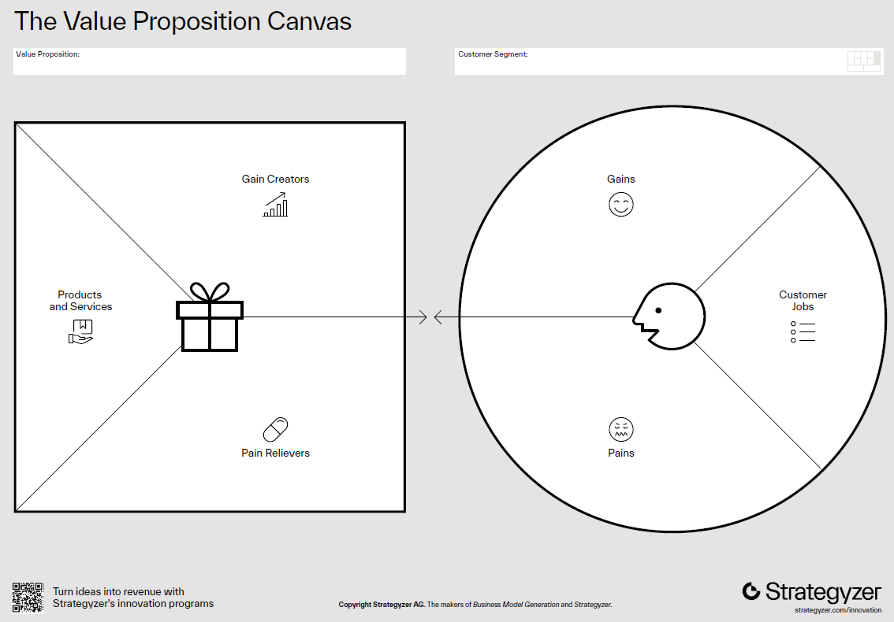

# Topic 4: Customer Development

Customer Development is a methodology proposed by Steve Blank in **The Four Steps to the Epiphany**. It challenges the traditional product development model by placing the customer at the center of the process. Instead of assuming that entrepreneurs know what customers want, Customer Development emphasizes discovery, validation, creation, and scaling through constant learning and iteration.

## Suggested Readings
- Blank, S. (2007). *The Four Steps to the Epiphany*, Wiley.  
- Blank, S., & Dorf, B. (2012). *The Startup Owner’s Manual*, Wiley.  
- Osterwalder, A., & Pigneur, Y. (2010). *Business Model Generation*, John Wiley & Sons.  
- Ries, E. (2011). *The Lean Startup*, Crown Business.

---

## 4.1 The Customer Development Revolution Using AI
In a **product development model**, customers are only sought after a product has been fully developed and launched, while the **customer development model** seeks them out from the very beginning to validate assumptions.

<!--  -->


**Your Customers Are Your Co-Founders:** Build what customers actually want, not what you think they want.
- **The Problem**: Many startups fail due to lack of market need
- **The Solution**: Systematic customer discovery, validation, and creation
- **AI Advantage**: Simulate customer interactions before talking to real people

**Quote**: *"Get out of the building!"* - Steve Blank

## 4.2 The Customer Development Framework
**Four Phases** <p>
The customer development framework is composed of four phases:
1. **Customer Discovery**: Identify who your customers are and whether the problem you are solving matters to them.
2. **Customer Validation**: Prove customers will pay for your solution and test if your business model is repeatable and scalable by creating a reproducible sales process.
3. **Customer Creation**: Generate demand and position your startup for market entry.
4. **Company Building**: Transition from a startup into a structured, mission-driven company.


> **Key Insight**: Each phase has specific hypotheses to test and metrics to track. <p>
> **AI Enhancement**: Use AI to accelerate hypothesis generation, interview preparation, and pattern analysis.

**Epiphany** <p> 
A sudden realization or discovery, often marking the turning point in understanding customer needs:
- Only a small amount of products that enter the market are profitable.
- Winning products are co-created with customers.
- Losing products are built in isolation and only handed off to sales/marketing.

**The Road to Disaster** <p>
Traditional product development often fails because:
- Customers are not included in early stages.
- Focus is on launch instead of learning.
- Metrics confuse sales/marketing outcomes with product development.
- Companies scale prematurely without validated demand.

## 4.3 Startup Categories
Understanding the type of market your product enters is essential:
- **Existing Market (Sustaining)**: Improve on what exists (e.g., smartphones).
- **New Market (Disruptive)**: Create something entirely new (e.g., VR headsets).
- **Low-Cost Market**: Offer cheaper alternatives (e.g., budget airlines).
- **Resegmented Market (Niche)** Create a new segment or redefine competition (e.g., Tesla’s luxury EVs).


## 4.4 Customer Discovery - Finding the Real Problem
**Goal**: Test whether the problem is real, significant, and solvable.

**Core Questions:**
- Who has this problem?
- How acute is the pain?
- What do they currently do to solve it?
- Why existing solutions fail them?
- What would make them switch?

**Process**:
1. **Define Hypotheses** (customers, problems, product, channels, competitors).
2. **Test Problem Hypotheses** (early customer interviews, understanding pain points).
3. **Test Product Hypotheses** (present concepts, gather reactions, iterate).
4. **Check & Iterate** (validate business model, restart if necessary).


**Key Customers**: Early adopters and “earlyvangelists” (those passionate enough to advocate for your solution).

**Traditional Approach**: Surveys, interviews, observation. <p>
**AI-Enhanced Approach**: Persona simulation, interview preparation, rapid hypothesis testing, pattern identification in feedback.

## Customer Discovery Summary
Your goal is to fill the table below for your startup:

| Hypothesis Area  | Key Assumptions | Validation Method | Findings |
|------------------|-----------------|-------------------|----------|
| Customers        | Who they are, segments | Interviews, surveys | |
| Problems         | Top 3 pains | Observation, interviews | |
| Product Concept  | Features, benefits | Mock-ups, feedback | |
| Competitors      | Existing alternatives | Market scan | |
| Channels/Price   | How to reach them, pricing ideas | Test channels | |

## CW 4.1: Customer Discovery with AI Support

This guide walks you through the **four steps of Customer Discovery** using AI prompts.  
Use these prompts in any LLM to simulate, prepare, and analyze before you validate with **real customers**.

### Step 1. Define Hypotheses

**Goal:** Identify initial assumptions about customers, their problems, product concept, channels, and competitors.

**Prompt 1 – Hypothesis Definition**
```
I am working on a startup idea in [insert your industry/problem area].

Help me define clear hypotheses in the following areas:
1. Customers – who are the potential segments and early adopters?
2. Problems – what top 3 pains might these customers face?
3. Product Concept – what features/benefits could solve these pains?
4. Competitors – what existing alternatives are out there?
5. Channels/Price – what ways could we reach them, and possible pricing approaches?

Return the result as a table with these columns: Hypothesis Area, Key Assumptions.
```

### Step 2. Test Problem Hypotheses

**Goal:** Use interviews or simulations to confirm whether the problem is real and painful.

**Prompt 2 – Problem Interview Preparation**
```
Act as a startup mentor.
Create 10 open-ended customer interview questions that test whether [problem area] is painful enough to solve.
Questions must focus on behavior and experience (not hypotheticals) and avoid leading the customer.
Organize them into an interview flow.
```

**Prompt 3 – Simulated Customer Responses**
```
Act as a potential customer in [target segment].
Answer the following interview questions as if you were experiencing this problem in real life.
[Paste here the interview questions generated previously]
Be specific about your frustrations, current workarounds, and what makes the situation painful.
```

### Step 3. Test Product Hypotheses

**Goal:** Present early product concepts and collect reactions.

**Prompt 4 – Product Concept Testing**
```
Here is my product concept: [insert short description of features/benefits].
Act as an early adopter customer.
React to this concept:
What excites you?
What confuses you?
What would make you hesitant to use it?
What missing feature would you expect?
Provide feedback in bullet points.
```

**Prompt 5 – Iteration Guidance**
```
Here are the customer reactions to my product concept: [paste summaries].
Suggest how I should refine my product concept to better address real pains and increase adoption.
Highlight which features are "must-haves" vs "nice-to-haves".
```

### Step 4. Check & Iterate

**Goal:** Review whether the problem, product, and business model hold together — or whether to pivot.

**Prompt 6 – Validation Summary**
```
Based on the findings from my customer discovery process, describe:
1. Hypotheses defined (customers, problems, product, competitors, channels)
2. Interview insights (main pains, gains, objections)
3. Product feedback (reactions, must-have features)

Help me fill in this Customer Discovery Summary table:
| Hypothesis Area | Key Assumptions | Validation Method | Findings |
| --------------- | --------------- | ----------------- | -------- |
| Customers       |                 |                   |          |
| Problems        |                 |                   |          |
| Product Concept |                 |                   |          |
| Competitors     |                 |                   |          |
| Channels/Price  |                 |                   |          |

Also, provide a recommendation: should I persevere, pivot, or restart?
```

**Deliverable: Customer Discovery Summary**

Each team should complete this table with validated evidence and add the results to your startup's personalized assistant:

| Hypothesis Area  | Key Assumptions | Validation Method | Findings |
|------------------|-----------------|-------------------|----------|
| Customers        | Who they are, segments | Interviews, surveys | |
| Problems         | Top 3 pains | Observation, interviews | |
| Product Concept  | Features, benefits | Mock-ups, feedback | |
| Competitors      | Existing alternatives | Market scan | |
| Channels/Price   | How to reach them, pricing ideas | Test channels | |

**Notes**:
- Use AI to **simulate** before you **validate with real customers**.  
- Always document the prompts you used and how AI shaped your process.  
- Early adopters and “earlyvangelists” are your most valuable discovery partners.  

---

### The Art of Customer Interviews
**Before AI**: Spend weeks preparing interview guides, recruiting participants, scheduling. <p>
**With AI**: Simulate dozens of interviews first, refine questions, practice difficult scenarios.

### AI-Powered Customer Persona Development
**Traditional Personas** (Static documents):
- Demographics, psychographics, basic needs

**AI-Enhanced Personas** (Interactive simulations):
- Dynamic conversation partners 
- Realistic objections and concerns  
- Varied cultural and professional backgrounds 
- Evolving based on new data inputs

**Business Value**: Test messaging, validate assumptions, practice pitches - all before spending time with real customers

---

## 4.5 Customer Validation - Proving Market Demand
**Goal**: Prove a repeatable and scalable sales process.  

*There is a huge difference between the first customers and the large mass of customers!*

**Process**:
1. Prepare for sales (value proposition, channels, MARCOM).  
2. Sell to **visionary customers**.  
3. Develop positioning vs. competitors.  
4. Verify or restart.  


### The Value Proposition Canvas
The **Value Proposition Canvas** is a strategic tool developed by *Strategyzer* (Osterwalder et al. https://www.strategyzer.com/) to help startups and businesses design products and services that truly meet customer needs.  
It ensures **fit** between what you offer and what your customers actually want.

**Two Main Parts**

**1. Customer Profile (right side)** <p>
Describes the customer’s world:
- **Jobs**: What customers are trying to get done (functional, emotional, social).  
- **Pains**: Problems, obstacles, or negative experiences they face while trying to do these jobs.  
- **Gains**: Desired outcomes, benefits, or positive results customers want.  

**2. Value Map (left side)** <p>
Describes how your startup creates value:
- **Products & Services**: What you are offering to customers.  
- **Pain Relievers**: How your product reduces or eliminates key pains.  
- **Gain Creators**: How your product delivers benefits and exceeds expectations.  

**The Goal: Achieve Fit** <p>
The aim of the VPC is to achieve **fit** between the **Value Map** and the **Customer Profile**:
- Your **pain relievers** must address the customer’s real **pains**.  
- Your **gain creators** must align with the customer’s desired **gains**.  
- Your **products/services** must help customers complete their **jobs** better than alternatives.  

**When to Use** <p>
The VPC is especially powerful during the **Customer Validation stage** of the Customer Development process, where startups test whether their assumptions about value actually resonate with customers.



**Validation Hierarchy:**
1. **Problem Validation**: Do customers agree the problem exists?
2. **Solution Validation**: Does your approach solve the problem and resonate?
3. **Payment Validation**: Will they actually pay?
4. **Scale Validation**: Can you reach enough customers profitably?

**AI Applications**: Analyze feedback patterns, predict customer lifetime value, simulate pricing scenarios, generate A/B testing frameworks

### The Five Customer Discovery Archetypes
- **The Enthusiast**: Loves new solutions, early adopter, provides great feedback
- **The Skeptic**: Questions everything, valuable for stress-testing ideas
- **The Pragmatist**: Needs proven ROI, represents mainstream market
- **The Traditionalist**: Resistant to change, helps understand adoption barriers
- **The Champion**: Becomes your internal advocate, drives organizational adoption


**AI Strategy**: Create detailed simulations of each archetype to practice tailored approaches

### Customer Validation Methodologies
- **Smoke Testing**: Landing pages measuring interest before building
- **Concierge MVP**: Manual delivery of core value proposition
- **Wizard of Oz Testing**: Automated experience powered by human backend
- **Pre-orders/Crowdfunding**: Direct financial commitment validation

**AI Enhancement**: Generate testing scenarios, analyze conversion data, predict scale requirements, optimize messaging

---

## CW 4.2: Customer Validation with AI Support

This guide walks you through the **four steps of Customer Validation** using AI prompts.  
Use these prompts in any LLM to simulate, prepare, and analyze before you validate with **real customers**. <p>
Before you start, search the web for the VPC of two companies and study their structure following the framework presented previously.

### Step 1. Prepare for Sales

**Goal:** Clarify your value proposition, channels, and MARCOM before approaching visionary customers. Build your Value Proposition Canvas (use [Strategyzer’s template](https://www.strategyzer.com/library/the-value-proposition-canvas)).  

**Prompt 1 – Drafting the Value Proposition Canvas (VPC)**
```
I am working on a startup idea in [insert industry/problem area].

Help me draft a Value Proposition Canvas with two parts:

1. Customer Profile
   - Jobs: functional, social, emotional jobs customers are trying to accomplish
   - Pains: main frustrations, obstacles, risks
   - Gains: positive outcomes customers desire

2. Value Map
   - Products/Services: what we offer
   - Pain Relievers: how we reduce or eliminate key pains
   - Gain Creators: how we create benefits or added value

Return the result in a table with evidence tags (Strong / Weak / Assumption).
```

**Prompt 2 – Channel and MARCOM Preparation**
```
Based on this Value Proposition Canvas [paste results],
suggest the top 3 marketing channels to reach early adopters.
For each channel, propose 2 MARCOM messages (short value-driven statements) aligned with pains and gains.
```

### Step 2. Sell to Visionary Customers

**Goal:** Simulate conversations with early adopters who are willing to take risks and provide feedback.

**Prompt 3 – Visionary Customer Simulation**
```
Act as a visionary customer in [target segment].
I will present my product concept: [insert description].
Respond with:
- What excites you most?
- What would stop you from buying?
- What evidence would convince you to try it now?
- Would you be willing to pre-order or pilot this? Why or why not?
```

**Prompt 4 – Objection Handling Practice**
```
List the 5 most common objections a visionary customer might raise when considering [product idea].
For each objection, suggest a strong, evidence-based response that builds credibility.
```

### Step 3. Develop Positioning vs. Competitors

**Goal:** Ensure your startup is clearly differentiated.

**Prompt 5 – Competitor Comparison**
```
Given these competitors: [list names],
create a competitor comparison table with columns:
Competitor | Customer Segment | Value Proposition | Strengths | Weaknesses | Price Point

Then, suggest how my startup could position itself uniquely in this landscape.
```

**Prompt 6 – Positioning Statement Testing**
```
Here are 3 positioning statements for my startup:
1. [Insert version 1]
2. [Insert version 2]
3. [Insert version 3]

Act as 3 different customer archetypes:
- The Enthusiast
- The Skeptic
- The Pragmatist

Rate each statement (1–5) for clarity, credibility, and differentiation.
Suggest improved wording that resonates better with each archetype.
```

### Step 4. Verify or Restart

**Goal:** Check if the business model is viable and scalable — or pivot if needed.

**Prompt 7 – Validation Summary**
```
Based on the VPC, customer simulations, and competitor positioning:

1. What assumptions were validated (with evidence)?
2. What assumptions remain weak or untested?
3. Are my channels and MARCOM aligned with early adopters?
4. Does my startup have a repeatable sales process emerging?

Help me complete this Customer Validation Summary table:

| Area                | Evidence Collected | Strength (S/M/W) | Next Action |
|---------------------|--------------------|------------------|-------------|
| Value Proposition   |                    |                  |             |
| Channels/MARCOM     |                    |                  |             |
| Visionary Customers |                    |                  |             |
| Positioning         |                    |                  |             |
| Business Model      |                    |                  |             |

Conclude with a recommendation: Should I persevere, pivot, or restart?
```

### Deliverable: Customer Validation Summary

Each team should complete this table with validated evidence and add the results to your startup's personalized assistant:

| Area               | Evidence Collected | Strength (S/M/W) | Next Action |
|--------------------|--------------------|------------------|-------------|
| Value Proposition  | Evidence from interviews & AI VPC | | |
| Channels/MARCOM    | Proposed channels and test campaigns | | |
| Visionary Customers| Simulation & early commitments | | |
| Positioning        | Competitor analysis & archetype reactions | | |
| Business Model     | Signs of repeatable, scalable process | | |

**Notes**:
- Use AI to **simulate visionary customers** before you engage real ones.  
- Always document the prompts you used and how AI shaped your process.  
- Focus on **repeatability and scalability**, not just initial enthusiasm.  

---

## 4.6 Customer Creation - Building Sustainable Demand
**Goal**: Generate demand and scale customer acquisition.  

**Philosophy:**
- Marketing depends on market type (existing, new, resegmented, or low-cost).  
- Goal is to become **#1 in something important** to your customers.    

**Process**:
1. Prepare for launch (define market, objectives, year 1 targets).
2. Position the company and product (internal and external positioning).
3. Launch the company and product (PR, campaigns, early customers).
4. Create demand (educate market, drive adoption, measure KPIs).


**Demand Generation Strategy:**
- **Earned Media**: Word-of-mouth, PR, thought leadership
- **Owned Media**: Content marketing, email, community building
- **Paid Media**: Advertising, sponsored content, influencer partnerships

**AI Applications**: Content generation, audience targeting, campaign optimization, customer journey mapping

### Common Customer Development Pitfalls
- **The False Positive**: Customer says they love it but won't pay
- **The Wrong Customer**: Talking to users instead of buyers
- **The Leading Question**: Biasing responses toward desired answers
- **The Feature Trap**: Focusing on features instead of problems
- **The Sample Bias**: Only talking to similar types of people

**AI Mitigation**: Objective analysis of feedback, diverse persona simulation, bias detection in interview data

---

## CW 4.3: Customer Creation with AI Support

This guide walks you through the **four steps of Customer Creation** using AI prompts.  
Use these prompts in any LLM to simulate, prepare, and analyze before you launch with **real customers**.

### Step 1. Prepare for Launch

**Goal:** Define market type, positioning objectives, and Year 1 customer creation targets.

**Prompt 1 – Market Type & Objectives**
```
I am working on a startup in [insert industry/problem area].
Help me define the market type (existing, new, low-cost, resegmented).
For this market type, propose:
- Year 1 customer creation objectives (adoption goals, target market share).
- Key risks and assumptions.
- Success metrics to monitor.
Return the results in a table with columns: Market Type, Objectives, Risks, Metrics.
```

**Prompt 2 – Year 1 Target Planning**
```
Based on my market type [insert], suggest 3 realistic Year 1 targets for:
1. Customer acquisition
2. Revenue
3. Awareness (media mentions, followers, newsletter sign-ups)
Provide benchmarks or comparables from similar startups if possible.
```

### Step 2. Position the Company and Product

**Goal:** Craft clear internal and external positioning that differentiates the startup.

**Prompt 3 – Positioning Draft**
```
Help me write internal and external positioning statements for my startup.

Internal positioning: how the team sees the company’s mission, values, and unique advantage.
External positioning: how customers, partners, and the press should perceive us.

Ensure both are aligned but distinct. Provide 3 versions for each.
```

**Prompt 4 – Messaging Variants**
```
Based on our Value Proposition Canvas and positioning,
generate 5 short MARCOM messages that highlight:
- 2 pains relieved
- 2 gains created
- 1 differentiator vs competitors
Make each message under 20 words and suitable for ads, landing pages, or social posts.
```

### Step 3. Launch the Company and Product

**Goal:** Design and simulate campaigns for launch (PR, content, channels, early adopters).

**Prompt 5 – Launch Campaign Plan**
```
Design a 90-day launch campaign for my startup.
Include:
- Earned media (PR, thought leadership, community buzz)
- Owned media (website, blog, newsletter, LinkedIn posts)
- Paid media (ads, influencers, sponsored content)
Provide a timeline (week by week) with 2–3 key activities each week.
```

**Prompt 6 – Early Adopter Engagement**
```
Suggest 3 strategies to involve early adopters in the launch of my product.
Focus on co-creation, advocacy, and word-of-mouth.
Provide sample tactics and example messages to use.
```

### Step 4. Create Demand

**Goal:** Educate the market, sustain adoption, and measure results with KPIs.

**Prompt 7 – Demand Creation Strategy**
```
For my startup in [insert industry],
design a demand creation strategy that includes:
1. Educational content themes for my market type
2. Channels to reach and convert early adopters
3. Referral or viral loops to encourage growth
4. KPIs for each activity (weekly and quarterly)
```

**Prompt 8 – KPI Dashboard Simulation**
```
Design a KPI dashboard for monitoring customer creation in Year 1.
Metrics should cover:
- Customer acquisition
- Activation (first use/engagement)
- Retention (repeat use or subscription renewal)
- Referral (customer advocacy)
- Revenue
Provide suggested targets and leading indicators for each metric.
```

### Deliverable: Customer Creation Summary

Each team should complete this table with validated evidence and targets, and add the results to your startup's personalized assistant:

| Area                  | Evidence/Plan                          | Year 1 Target | KPIs to Track            | Next Action |
|-----------------------|----------------------------------------|---------------|--------------------------|-------------|
| Market Type & Goals   | Existing / New / Low-cost / Resegmented|               | Adoption, Share, Revenue |             |
| Positioning           | Internal + External statements         |               | Message clarity metrics  |             |
| Launch Campaign       | PR, Owned, Paid activities             |               | Leads, Trials, Sign-ups  |             |
| Early Adopter Plan    | Engagement & advocacy tactics          |               | Referrals, Testimonials  |             |
| Demand Creation       | Education + Growth loops               |               | Activation, Retention    |             |
| KPI Dashboard         | Suggested tracking framework           |               | All metrics above        |             |

---

**Notes**:
- Use AI to **simulate launch campaigns and positioning** before you run them.  
- Always test messages with **real customers and channels** after AI drafting.  
- Focus on **measurable adoption, not just activity**.  


