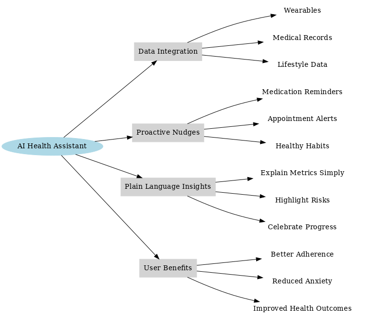
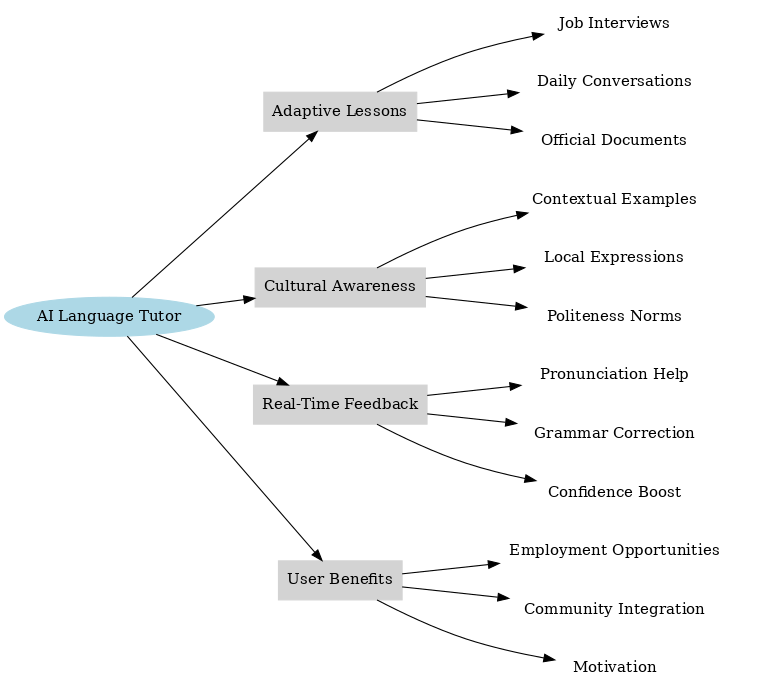

# Topic 5: Design Thinking and Ideation
Design Thinking and Ideation are complementary approaches to innovation. **Design Thinking** is a human-centered problem-solving methodology that emphasizes empathy, creativity, and experimentation to ensure solutions truly address user needs. It follows iterative stages (empathize, define, ideate, prototype, and test) to reduce risks and align products with real-world demands. **Ideation**, as a core stage in this process, focuses on generating a wide range of creative ideas without judgment, using techniques like **brainstorming**, **mind mapping**, and **SCAMPER**. Together, they help entrepreneurs build innovative, user-centric, and impactful solutions.

## Suggested Readings
- Brown, T. (2009). *Change by Design: How Design Thinking Transforms Organizations and Inspires Innovation.* HarperBusiness.  
- Knapp, J. (2016). *Sprint: Solving Big Problems and Testing New Ideas in Just Five Days.* GV Press.  

## 5.1 Introduction to Design Thinking
Design Thinking is a **user-centric problem-solving methodology** that emphasizes empathy, creativity, collaboration, ideation, and experimentation.  

**Relevance for AI-Based Startups**:  
- Ensures that AI solutions address real human needs.  
- Balances technological feasibility with user desirability and business viability.  

## 5.2 Principles of Design Thinking
The principles of design thinking provide a structured, human-centered approach to innovation, guiding entrepreneurs through the stages of empathizing with users, defining problems, ideating solutions, prototyping, and testing to create impactful outcomes:

### Empathize
- Understand users’ needs, emotions, and behaviors.  
- Techniques: interviews, surveys, observation, empathy maps.  

### Define
- Narrow down insights into a clear **problem statement**.  
- Tools: “How Might We” questions, point-of-view statements.  

### Ideate
- Generate a broad range of ideas without judgment.  
- Techniques: brainstorming, mind mapping, SCAMPER.  

### Prototype
- Build low-fidelity models or mockups of solutions.  
- Examples: wireframes, MVPs, storyboards.  

### Test
- Collect user feedback to refine solutions.  
- Methods: usability testing, A/B testing, feedback loops.  


## 5.3 Tools and Applications

### 5.3.1 Empathy Maps
A **visual tool** to capture what users **say, think, do, and feel**. Helps teams gain deeper insights into the user’s perspective.


**When to Use**:  
- Early product/service development.  
- Designing new features.  
- Evaluating existing products.  

---

### Empathy Map Examples for AI-Based Startups

**Empathy Map 1: AI Personal Health Companion**

| **Says** | **Thinks** |
|----------|------------|
| “I don’t have time to constantly track my health data.” | “If I don’t stay on top of this, my condition will worsen.” |
| “Doctors give me advice, but I forget to follow it.” | “I wish I had personalized insights, not just generic advice.” |

| **Does** | **Feels** |
|----------|-----------|
| Uses a smartwatch sporadically. | Guilty for not being more disciplined. |
| Googles symptoms late at night. | Anxious about long-term health outcomes. |
| Misses doctor appointments due to schedule conflicts. | Relieved when someone explains data in simple terms. |

**Empathy Map 2: AI-Powered Language Tutor for Immigrants**

| **Says** | **Thinks** |
|----------|------------|
| “I want to practice English, but I’m embarrassed to make mistakes.” | “If I improve my English, I’ll find a better job.” |
| “Language schools are expensive and not flexible with my job schedule.” | “AI apps are helpful, but they don’t understand my cultural context.” |

| **Does** | **Feels** |
|----------|-----------|
| Practices with YouTube or Duolingo at night. | Isolated in the community. |
| Avoids conversations with native speakers. | Hopeful about building a better future. |
| Relies on family to translate official documents. | Motivated when small progress is recognized. |

> Search the web for Emphaty Maps of two situations or products and study their structure following the framework presented previously.

**AI Prompt Example:**
```
I am designing an AI-based startup in [industry/problem area].  
Help me create an Empathy Map for my target user.  
Structure it into the four quadrants:  
1. Says – direct quotes or statements from users  
2. Thinks – what they might be thinking but not saying  
3. Does – their observable actions and behaviors  
4. Feels – their emotions, frustrations, or motivations  
Return the result in a table with columns: Quadrant | Insights.
```

### 5.3.2 Mind Mapping
**Definition**: A visual brainstorming tool for organizing ideas around a central concept.  

**Benefits**:  
- Encourages creativity.  
- Highlights relationships among ideas.  
- Supports non-linear thinking.  

### Mind Map Examples for AI-Based Startups

**Mind Map 1: AI Personal Health Companion**



**Mind Map 2: AI-Powered Language Tutor for Immigrants**



> Search the web for Mind Maps of two products or solutions and study their structure following the framework presented previously.

**AI Prompt Example:**
```
I am building a mind map for my AI startup idea in [problem area].  
Create a hierarchical structure with:  
- Central Node: Startup Idea  
- First-Level Branches: Target Audience, Problem Hypothesis, Product Hypothesis, AI Features, Competitors, Business Model  
- Sub-Branches: Add details, examples, or key questions under each.  
Return the mind map as a nested bullet list.
```

### 5.3.3 SCAMPER Technique
A structured method for ideation by modifying existing solutions:  
1. **Substitute**  
2. **Combine**  
3. **Adapt**  
4. **Modify**  
5. **Put to Another Use**  
6. **Eliminate**  
7. **Reverse**  


---

### SCAMPER Examples for AI-Based Startup Solutions

**Case 1: AI Personal Health Companion**

**S – Substitute**  
- Replace **generic reminders** with **personalized AI nudges** (based on daily routines).  

**C – Combine**  
- Integrate **wearables, EHR data, and nutrition apps** into one platform.  

**A – Adapt**  
- Adapt **fitness gamification** strategies (badges, streaks) to chronic health management.  

**M – Modify**  
- Modify the **user interface** to show plain-language explanations (e.g., “Your sugar levels are trending high” instead of “HbA1c deviation”).  

**P – Put to Other Uses**  
- Use the same system for **preventive care** in healthy users (early warning, lifestyle coaching).  

**E – Eliminate**  
- Eliminate the **complexity of reading raw medical metrics** by offering visual, color-coded dashboards.  

**R – Reverse**  
- Instead of only tracking what’s wrong, **start by celebrating health improvements** (reverse the focus from risk to progress).  

---

**Case 2: AI-Powered Language Tutor for Immigrants**

**S – Substitute**  
- Substitute **static textbook exercises** with **AI role-playing conversations** (e.g., practice ordering food).  

**C – Combine**  
- Combine **speech recognition** with **cultural context AI** to give tailored corrections.  

**A – Adapt**  
- Adapt **voice assistants (Alexa, Siri)** into **language practice partners** for real-life tasks.  

**M – Modify**  
- Modify the app to allow **offline use** for low-connectivity communities.  

**P – Put to Other Uses**  
- Use the same platform to train **job-specific jargon** (e.g., healthcare English, construction terms).  

**E – Eliminate**  
- Eliminate the **fear of judgment** by creating **anonymous AI practice sessions** before real conversations.  

**R – Reverse**  
- Reverse the process by **allowing learners to teach the AI their native language** (mutual exchange builds confidence).  

> Search the web for examples of the SCAMPER method.

**AI Prompt Example:**
```
I want to apply the SCAMPER technique to my AI startup solution in [problem area].  
For each of the 7 steps, suggest at least 2 new ideas or variations:  
1. Substitute  
2. Combine  
3. Adapt  
4. Modify  
5. Put to Another Use  
6. Eliminate  
7. Reverse  
Return the results in a table with columns: Step | New Ideas.
```

## 5.4 The Role of Design Thinking in AI-Based Startups
- Encourages **user-centric AI solutions**.  
- Reduces risk through **early validation**.  
- Fosters **creativity and innovation**.  
- Aligns technology with **real-world needs**.  

---

## Classwork Activities

### CW 5.1: Empathy Map Examples
- Search online for examples of empathy maps.  
- Present one in class and discuss its benefits for product design.  

### CW 5.2: Mind Mapping
- Create a **mind map** for your startup, including:  
  - Target audience  
  - Problem hypothesis  
  - Product hypothesis  
  - AI features  
  - Competitors  
  - Business model  

### CW 5.3: Applying SCAMPER
- Use your mind map and apply SCAMPER prompts to explore alternative solutions.  

### CW 5.4: Case Studies in Design Thinking
- Research a startup that successfully applied design thinking.  
- Present a short case study in class.  

