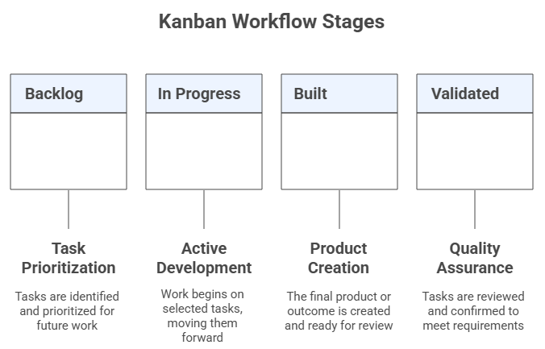

# Topic 6: Lean Startup
The **Lean Startup** is a scientific approach to building new products and services under conditions of **extreme uncertainty**. Grounded in **Lean Thinking** (eliminating waste and maximizing value), it replaces lengthy planning with rapid **Build–Measure–Learn** cycles that validate hypotheses with real customers. The goal is to **discover what to build**, something customers want and will pay for, in the **shortest possible time and using the smallest amount of resources**.

## Suggested Readings
- Ries, E. (2011). *The Lean Startup*. Crown Currency.  
- Womack, J. P., & Jones, D. T. (2003). *Lean Thinking: Banish Waste and Create Wealth in Your Corporation*. Free Press.  
- Blank, S., & Dorf, B. (2012). *The Startup Owner’s Manual*. K & S Ranch.  

---

## 6.1 Lean Thinking & Startups
**Lean Thinking** aims to do **more with less** (less time, space, budget, and effort) while delivering **exactly** what customers want. Five guiding principles: 
1) Define Value → from the **customer’s perspective**  
2) Map the Value Stream  
3) Create Flow  
4) Establish Pull  
5) Pursue Perfection  

In startups, this translates into learning fast which activities create value and eliminating everything else (*muda*, waste).


**What is a Startup?**  
> “A human institution designed to create a new product or service under **extreme uncertainty**.”  
**Primary goal:** discover, as fast as possible, **what to build** that customers want and will buy.

**Core principles for startups:**  
1) Entrepreneurs are everywhere
2) Entrepreneurship is management
3) Validated learning
4) Build–Measure–Learn
5) Innovation accounting

## 6.2 The Build–Measure–Learn (B–M–L) Loop
The Lean method is an iterative loop:

**Build** → turn hypotheses into an **MVP**  
**Measure** → collect **actionable, accessible, auditable** metrics (avoid vanity metrics)  
**Learn** → decide to **persevere** or **pivot** based on evidence  

  
*Use B–M–L to validate both the **Value hypothesis** (“do users get value?”) and the **Growth hypothesis** (“how do new users find it?”).*

## 6.3 Minimum Viable Product (MVP)
An **MVP** is the smallest product experiment that enables a **full B–M–L cycle** with **minimal cost and time**. Forms include **demo videos**, **concierge/Wizard-of-Oz** services, clickable prototypes, spreadsheets, landing pages, etc. Classic examples (e.g., early Dropbox video) show how to validate demand **before** investing in full builds.

  

## 6.4 Innovation Accounting & Metrics (AARRR)
To know if you are making real progress, use **innovation accounting**:

- **AARRR funnel:** **Acquisition → Activation → Retention → Referral → Revenue**  
- Metric properties: **Actionable** (clear cause–effect), **Accessible** (simple, concrete), **Auditable** (verifiable)  
- Prefer **cohort analysis** (behavior over time by signup batch) to vanity metrics


**Cohort sketch**

| Cohort (Week) | Users | D+1 | D+7 | D+14 | D+28 |
|---|---:|---:|---:|---:|---:|
| W1 | 120 | 42% | 25% | 17% | 10% |
| W2 | … | … | … | … | … |

## 6.5 Learn: Persevere or Pivot
**Validated learning** is the empirical proof you have learned something true about customers. When learning plateaus or usage declines, consider a **pivot** (a **structured course correction**) to test a new hypothesis (product, strategy, or growth engine). Reassess on a cadence (e.g., every **2–4 months**).

**Pivot catalog:** 
- Zoom-in/Zoom-out
- Customer Segment
- Customer Need
- Platform
- Business Model
- Growth
- Channel
- Technology


## 6.6 Engines of Growth
Choose and instrument **one primary engine** at a time:

- **Sticky:** focus on retention/return use (minimize churn).  
- **Viral:** product use drives invites/shares (viral coefficient > 1).  
- **Paid:** CAC < LTV via sales/ads; scale with positive unit economics.


## 6.7 Tools & Templates

### 6.7.1 MVP Experiment Card
- **Hypothesis (Value/Growth):**  
- **MVP type:** (landing page / clickable prototype / concierge / demo video / email test)  
- **Who (segment):**  
- **What happens (procedure):**  
- **Primary metric & threshold:**  
- **Time window:**  
- **Decision rule:** persevere / pivot candidate / follow-up test

### 6.7.2 AARRR Plan (one line each)
- **Acquisition:** channel + qualifying event  
- **Activation:** “good first experience” definition  
- **Retention:** return criterion & window  
- **Referral:** built-in invite or incentive  
- **Revenue:** pricing unit & leading indicator

### 6.7.3 Kanban for Validated Learning
Columns: **Backlog → In Progress → Done → Validated** with **Work in Progrsss (WIP) limits**. Prioritize items that maximize **learning per unit time**.



---

## 6.8 Worked Examples (Topic 5 Cases)

Below are end-to-end Lean Startup examples for the two Topic 5 cases:
1) **AI Personal Health Companion**  
2) **AI-Powered Language Tutor for Immigrants**

Each case includes: Lean Principles Cycle → B-M-L Loop → AARRR & Cohorts → Possible Pivots → Engines of Growth → Kanban.

### Case A — AI Personal Health Companion

#### A.1 Lean Principles Cycle (Value → Flow → Pull → Perfection)

**Define Value (Customer’s view)**  
- Value = *plain-language, timely insights* that reduce anxiety and help follow care plans.  
- Top “jobs”: track vitals; understand anomalies; follow doctor plan.

**Map Value Stream**  
- Data intake (wearables/EHR) → Insight generation (rules/LLM) → Delivery (mobile cards/SMS) → User action (acknowledge/save) → Outcome (adherence, reduced anxiety).

**Create Flow**  
- Batch nightly → switch to event-triggered “insight cards” to shorten time-to-value (< 5 min from reading to nudge).

**Establish Pull**  
- Users subscribe to specific concerns (e.g., glucose spikes).  
- Only push insights when thresholds/metaconditions met (avoid notification fatigue).

**Pursue Perfection**  
- Weekly defect review: % irrelevant insights, % late notifications.  
- Kaizen: prune rules, refine language, personalize timing windows.

#### A.2 Build–Measure–Learn (B-M-L) Loop

**Leap-of-Faith (Value)**  
- *Hypothesis:* “Plain-language insight cards increase activation to ≥ **30%** in 7 days.”

**Build (MVP)**  
- Wizard-of-Oz: clinician/analyst curates daily SMS/email “insight cards” for a 50-user waitlist.

**Measure (Actionable metric)**  
- **Activation:** open ≥3 insights + save ≥1 card within 7 days.

**Learn (Decision rule)**  
- If Activation ≥ 30% → persevere: build lightweight in-app insights.  
- If < 20% → test **Customer Need** pivot (timing vs. content; anxiety vs. adherence focus).

#### A.3 AARRR Metrics & Cohort Table

**AARRR Plan**

| Stage | Metric (Definition) | Target | Instrumentation |
|---|---|---:|---|
| Acquisition | LP signup rate (% unique visitors → email) | ≥ 12% | LP analytics + unique email capture |
| Activation | % who open ≥3 insights + save ≥1 card (7d) | ≥ 30% | Event logs (open/save) |
| Retention | D+7/D+28 return to view insights | D+7 ≥ 25%, D+28 ≥ 12% | Cohort tracking |
| Referral | Avg invites per user × invite CVR (K) | K ≥ 0.25 | Invite links + attribution |
| Revenue | Trial→paid conversion (30d) | ≥ 8% | Billing events |

**Cohort Sketch (Activation & Retention)**

| Cohort (Week) | Users | Activation (7d) | D+7 Retention | D+28 Retention |
|---|---:|---:|---:|---:|
| W1 | 50 | 34% | 26% | 12% |
| W2 | 65 | 31% | 24% | 11% |
| W3 | 80 | 29% | 22% | 10% |

#### A.4 Possible Pivots (Triggers & Actions)

| Pivot Type | Trigger (Signal) | Action |
|---|---|---|
| Customer Need | Activation ≥ 30% but D+28 < 10% | Shift focus: medication reminders → clinician Q&A “micro-explanations” |
| Zoom-In | 70% of usage on “trend explanation” feature | Make “trend cards” the core product; remove low-use modules |
| Channel | CAC volatile; payback > 6 months | Test provider referral channel (clinics bundle app) |
| Business Model | High use, low conversion | Introduce family plan + clinician dashboard upsell |

#### A.5 Engines of Growth (Choice & Next Experiment)

- **Sticky (recommended first):** build retention via timely, high-relevance insights.  
  - *Next test:* notification timing personalization A/B; target +3–5pp D+7.
- **Viral:** caregiver sharing; “Share insight with family/doctor.”  
  - *Next test:* 1-click share; measure K-factor change (baseline ~0.1 → goal 0.2–0.25).
- **Paid:** employer/insurer B2B2C; CAC via brokers.  
  - *Next test:* pilot with small clinic; track CAC, payback.

#### A.6 Kanban (2-Week Sprint)

**Backlog**  
- Personalize send-time model  
- Single-tap “Save & Share”  
- LP value-prop rewrite (doctor-approved phrasing)  
- D+7 retention dashboard

**In Progress (WIP 3)**  
- Event logging for “save/share”  
- SMS template tone A/B  
- Clinic pilot one-pager

**Done**  
- Cohort pipeline v1  
- Invite attribution links

**Validated**  
- Activation metric definition (auditable)  
- W1/W2 cohort retention stable within ±2pp

Daily stand-up script: *Yesterday/Today/Blockers*, confirm WIP limits, review single “learning goal” for the day.

---

### Case B — AI-Powered Language Tutor for Immigrants

#### B.1 Lean Principles Cycle

**Define Value**  
- Value = *low-anxiety, job-relevant speaking practice* available on-demand.

**Map Value Stream**  
- Topic selection → Conversational role-play → Real-time feedback → Micro-goals → Progress badges.

**Create Flow**  
- Remove sign-up friction; “Practice now” in 2 taps; cached offline lessons.

**Establish Pull**  
- Learners pick contexts (work, healthcare, school); app adapts vocabulary to goals.

**Pursue Perfection**  
- Track *correction usefulness* rating; reduce latency in speech feedback.

#### B.2 Build–Measure–Learn (B-M-L) Loop

**Leap-of-Faith (Value)**  
- *Hypothesis:* “Contextual role-plays reduce speaking anxiety and raise activation to ≥ **40%** in 7 days.”

**Build (MVP)**  
- Clickable prototype + scripted role-play via human moderator (Wizard-of-Oz) in messaging app.

**Measure**  
- **Activation:** complete ≥2 role-plays + accept ≥1 correction in 7 days.

**Learn**  
- If Activation ≥ 40% → persevere; build automated role-play with ASR feedback.  
- If < 25% → test **Customer Segment** pivot (job seekers vs. newcomers vs. students).

#### B.3 AARRR Metrics & Cohort Table

**AARRR Plan**

| Stage | Metric (Definition) | Target | Instrumentation |
|---|---|---:|---|
| Acquisition | % visitors starting a “Practice now” session | ≥ 15% | LP → app deep-link |
| Activation | ≥2 role-plays + ≥1 accepted correction (7d) | ≥ 40% | Session & feedback logs |
| Retention | Weekly active learners (WAU/Users by cohort) | W2 ≥ 35%, W4 ≥ 20% | Cohort tracking |
| Referral | Avg invites per learner × CVR | K ≥ 0.3 | Invite links |
| Revenue | Course pack purchase (30d) | ≥ 6% | Billing events |

**Cohort Sketch (Activation & Retention)**

| Cohort (Week) | Users | Activation (7d) | W2 Retention | W4 Retention |
|---|---:|---:|---:|---:|
| W1 | 100 | 43% | 36% | 21% |
| W2 | 120 | 39% | 33% | 19% |
| W3 | 140 | 41% | 35% | 20% |

#### B.4 Possible Pivots

| Pivot Type | Trigger (Signal) | Action |
|---|---|---|
| Customer Segment | Activation students 48% vs. job seekers 28% | Narrow ICP to students; tailor scenarios & pricing |
| Zoom-In | 75% usage on “job interview coach” | Make interview coach the product; deprecate generic lessons |
| Channel | Organic stalls; schools request bulk codes | Partner with community colleges/NGOs for cohort onboarding |
| Pricing/Model | High retention, low purchase | Freemium minutes + paid “coach review” packs |

#### B.5 Engines of Growth

- **Viral (recommended first):** peer challenges, teacher cohorts.  
  - *Next test:* “Invite a partner” role-play; measure K from 0.25 → 0.4.
- **Sticky:** streaks, progress badges, job-specific goals.  
  - *Next test:* micro-goals with weekly review; target W2 +3pp.
- **Paid:** school licenses; recruiter bundles.  
  - *Next test:* NGO pilot; track CAC, conversion to site licenses.

#### B.6 Kanban (2-Week Sprint)

**Backlog**  
- “Practice now” single-tap entry  
- Interview-coach preset flows  
- Invite-a-partner experiment  
- Latency reducer for ASR feedback

**In Progress (WIP 3)**  
- Partner invite links + attribution  
- Preset flows for healthcare & hospitality  
- Weekly progress email prototype

**Done**  
- Onboarding text rewrite  
- Cohort dashboard v1

**Validated**  
- Activation metric (auditable)  
- W1/W2 cohorts show +3pp WAU after preset flows

Daily stand-up script: confirm *one* learning objective per day, check experiment health (exposure, power), unblock critical path tasks.

---

## Quick Cross-Case Reference

| Element | Health Companion | Language Tutor |
|---|---|---|
| **Value Hypothesis** | Insight cards reduce anxiety → activation ≥ 30% | Role-plays reduce anxiety → activation ≥ 40% |
| **Primary Engine (start)** | Sticky (timely insights) | Viral (peer/teacher loops) |
| **Early Pivot Watch** | Need vs. timing; zoom-in on trend cards | Segment focus (students), zoom-in on interview coach |
| **North-Star Early** | D+7 retention | Weekly active learners (WAU/Cohort) |

---

## 6.9 AI-Assisted Practice Prompts

**Prompt — LoF & MVP Design**  
```
You are my Lean Startup coach. Given the startup context below, list our top 3 Leap-of-Faith assumptions (clearly label Value vs Growth), propose 2–3 scrappy MVP experiments to test the Value hypothesis in ≤7 days, and define one actionable metric + success threshold for each. Outline risks/biases and how to minimize them.
Context: [paste idea, target user, problem]
```

**Prompt — Metrics & AARRR**  
```
Design an AARRR plan for our MVP: specify one actionable, accessible, auditable metric per stage with operational definitions, a logging plan, and a 2-week cohort table template I can fill out.
```

**Prompt — Persevere vs Pivot**  
```
Using our latest cohort metrics (below), assess whether to persevere or pivot. If pivoting, recommend the best pivot type and justify with evidence. Provide a 2-week action plan.
Data: [activation/retention/referral/revenue]
```

**Prompt — Choose a Growth Engine**  
```
Evaluate sticky vs viral vs paid growth for our product. Estimate simple unit economics (assume values if missing), identify the limiting constraint, and propose the next experiment to validate the chosen engine.
```

**Prompt — Learning Kanban**  
```
Create a 2-week Lean Kanban with 8–12 items across Backlog / In Progress / Done / Validated, prioritizing experiments that maximize learning per unit time. Include a daily stand-up script and WIP limits.
```

## CW 6.1 In-Class Activities
**Objective:** Turn your idea into a week-long learning plan.

1) **MVP Experiment Card** (one page)  
2) **AARRR Plan** (one page)  
3) **Cohort Table** (skeleton with target thresholds)

*Submission:* 2 pages (PDF) per team. In class share-outs for feedback.

---

## HW 6.1 Homework
> **For your STARTUP, prepare one complete MVP:** define the hypotheses, MVP, evaluation metrics, and discuss **pivot vs persevere** conditions. Deliver as a **2–3 page brief** with one figure per MVP.

**Rubric (10 pts)**  
- Clear LoF & hypotheses (2)
- MVP feasibility in ≤7 days (2)
- Metrics (AARRR) & thresholds (3)
- Decision rules & next steps (2)
- Clarity & formatting (1)

## Final Deliverables (Upload to Canvas)
- **HW 6.1:** One MVPs brief (PDF, 2–3 pages).  
