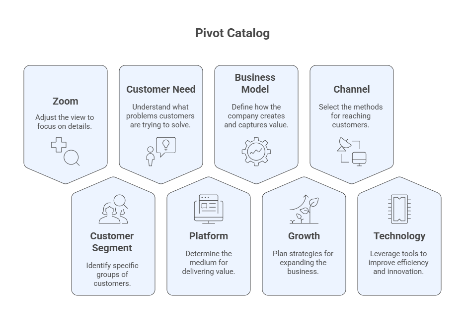

# Topic 6: Lean Startup
The **Lean Startup** is a scientific approach to building new products and services under conditions of **extreme uncertainty**. Grounded in **Lean Thinking** (eliminating waste and maximizing value), it replaces lengthy planning with rapid **Build–Measure–Learn** cycles that validate hypotheses with real customers. The goal is to **discover what to build**, something customers want and will pay for, in the **shortest possible time and using the smallest amount of resources**.

## Suggested Readings
- Ries, E. (2011). *The Lean Startup*. Crown Currency.  
- Womack, J. P., & Jones, D. T. (2003). *Lean Thinking: Banish Waste and Create Wealth in Your Corporation*. Free Press.  
- Blank, S., & Dorf, B. (2012). *The Startup Owner’s Manual*. K & S Ranch.  

---

## 6.1 Lean Thinking & Startups
**Lean Thinking** aims to do **more with less** (less time, space, budget, and effort) while delivering **exactly** what customers want. Five guiding principles: 
1) Define Value → from the **customer’s perspective**  
2) Map the Value Stream  
3) Create Flow  
4) Establish Pull  
5) Pursue Perfection  

In startups, this translates into learning fast which activities create value and eliminating everything else (*muda*, waste).


**What is a Startup?**  
> “A human institution designed to create a new product or service under **extreme uncertainty**.”  
**Primary goal:** discover, as fast as possible, **what to build** that customers want and will buy.

**Core principles for startups:**  
1) Entrepreneurs are everywhere
2) Entrepreneurship is management
3) Validated learning
4) Build–Measure–Learn
5) Innovation accounting

## 6.2 The Build–Measure–Learn (B–M–L) Loop
The Lean method is an iterative loop:

**Build** → turn hypotheses into an **MVP**  
**Measure** → collect **actionable, accessible, auditable** metrics (avoid vanity metrics)  
**Learn** → decide to **persevere** or **pivot** based on evidence  

  
*Use B–M–L to validate both the **Value hypothesis** (“do users get value?”) and the **Growth hypothesis** (“how do new users find it?”).*

## 6.3 Minimum Viable Product (MVP)
An **MVP** is the smallest product experiment that enables a **full B–M–L cycle** with **minimal cost and time**. Forms include **demo videos**, **concierge/Wizard-of-Oz** services, clickable prototypes, spreadsheets, landing pages, etc. Classic examples (e.g., early Dropbox video) show how to validate demand **before** investing in full builds.

  

## 6.4 Innovation Accounting & Metrics (AARRR)
To know if you are making real progress, use **innovation accounting**:

- **AARRR funnel:** **Acquisition → Activation → Retention → Referral → Revenue**  
- Metric properties: **Actionable** (clear cause–effect), **Accessible** (simple, concrete), **Auditable** (verifiable)  
- Prefer **cohort analysis** (behavior over time by signup batch) to vanity metrics


**Cohort sketch**

| Cohort (Week) | Users | D+1 | D+7 | D+14 | D+28 |
|---|---:|---:|---:|---:|---:|
| W1 | 120 | 42% | 25% | 17% | 10% |
| W2 | … | … | … | … | … |

## 6.5 Learn: Persevere or Pivot
**Validated learning** is the empirical proof you have learned something true about customers. When learning plateaus or usage declines, consider a **pivot** (a **structured course correction**) to test a new hypothesis (product, strategy, or growth engine). Reassess on a cadence (e.g., every **2–4 months**).

**Pivot catalog:** 
- Zoom-in/Zoom-out
- Customer Segment
- Customer Need
- Platform
- Business Model
- Growth
- Channel
- Technology



## 6.6 Engines of Growth
Choose and instrument **one primary engine** at a time:

- **Sticky:** focus on retention/return use (minimize churn).  
- **Viral:** product use drives invites/shares (viral coefficient > 1).  
- **Paid:** CAC < LTV via sales/ads; scale with positive unit economics.


## 6.7 Tools & Templates

### 6.7.1 MVP Experiment Card
- **Hypothesis (Value/Growth):**  
- **MVP type:** (landing page / clickable prototype / concierge / demo video / email test)  
- **Who (segment):**  
- **What happens (procedure):**  
- **Primary metric & threshold:**  
- **Time window:**  
- **Decision rule:** persevere / pivot candidate / follow-up test

### 6.7.2 AARRR Plan (one line each)
- **Acquisition:** channel + qualifying event  
- **Activation:** “good first experience” definition  
- **Retention:** return criterion & window  
- **Referral:** built-in invite or incentive  
- **Revenue:** pricing unit & leading indicator

### 6.7.3 Kanban for Validated Learning
Columns: **Backlog → In Progress → Done → Validated** with **WIP limits**. Prioritize items that maximize **learning per unit time**.

---

## 6.8 AI-Assisted Practice Prompts

**Prompt — LoF & MVP Design**  
```
You are my Lean Startup coach. Given the startup context below, list our top 3 Leap-of-Faith assumptions (clearly label Value vs Growth), propose 2–3 scrappy MVP experiments to test the Value hypothesis in ≤7 days, and define one actionable metric + success threshold for each. Outline risks/biases and how to minimize them.
Context: [paste idea, target user, problem]
```

**Prompt — Metrics & AARRR**  
```
Design an AARRR plan for our MVP: specify one actionable, accessible, auditable metric per stage with operational definitions, a logging plan, and a 2-week cohort table template I can fill out.
```

**Prompt — Persevere vs Pivot**  
```
Using our latest cohort metrics (below), assess whether to persevere or pivot. If pivoting, recommend the best pivot type and justify with evidence. Provide a 2-week action plan.
Data: [activation/retention/referral/revenue]
```

**Prompt — Choose a Growth Engine**  
```
Evaluate sticky vs viral vs paid growth for our product. Estimate simple unit economics (assume values if missing), identify the limiting constraint, and propose the next experiment to validate the chosen engine.
```

**Prompt — Learning Kanban**  
```
Create a 2-week Lean Kanban with 8–12 items across Backlog / In Progress / Done / Validated, prioritizing experiments that maximize learning per unit time. Include a daily stand-up script and WIP limits.
```

## CW 6.1 In-Class Activities
**Objective:** Turn your idea into a week-long learning plan.

1) **MVP Experiment Card** (one page)  
2) **AARRR Plan** (one page)  
3) **Cohort Table** (skeleton with target thresholds)

*Submission:* 2 pages (PDF) per team. In class share-outs for feedback.

---

## HW 6.1 Homework
> **For the company MYBUSINESS, prepare two complete MVPs:** define the hypotheses, MVP, evaluation metrics, and discuss **pivot vs persevere** conditions. Deliver as a **2–3 page brief** with one figure per MVP.

**Rubric (10 pts)**  
- Clear LoF & hypotheses (2)
- MVP feasibility in ≤7 days (2)
- Metrics (AARRR) & thresholds (3)
- Decision rules & next steps (2)
- Clarity & formatting (1)

## Final Deliverables (Upload to Canvas)
- **CW 6.1:** MVP Experiment Card + AARRR Plan (PDF, 2 pages).  
- **HW 6.1:** Two MVPs brief (PDF, 2–3 pages).  
- (Optional) **Cohort spreadsheet** (.xlsx/.csv) with first-week activation and D+7 retention.
